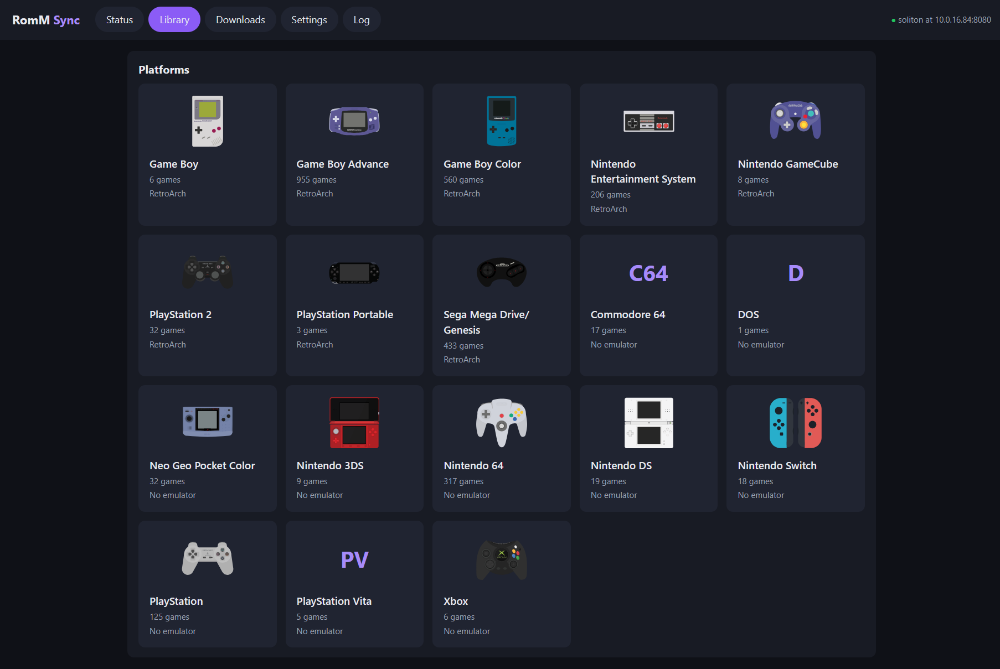

# RomM Sync for PS5



A [RomM](https://romm.app) companion client for jailbroken PS5 consoles (etaHEN + kstuff). Through my insatiable need to mod everything electronic I encounter, I had my 12.70 PS5 jailbroken the minute that P2JB was out. I maintain a RomM server to centralize all my _legal_ ROMs, saves, and savestates which all my devices sync with, and the PS5 needs similar treatment.

- **Background save sync**
  - Monitors save file changes in the background, and uploads them as soon as they've changed. Periodic syncs also ensure that your PS5 always has the latest saves and savestates.
- **Interactive library**
  - Browse RomM from the PS5 browser (or some other device), download games and BIOS files into the right emulator folders, and resolve save conflicts.
- **Pluggable emulator profiles**
  - RetroArch is supported out of the box. Mednafen and a PS2-ISO profile are included but disabled. I'll make sure we update as more emulators become available on the console.

## Supported Emulators and Games

Technically, this RomM client will work with all emulators, but the PS5 is currently limited on emulators available. This is simply a matter of time, and the client will be updated frequently as new emulators are released. Currently, we have focused on using mihawk-99's unofficial implementation of RetroArch. It works beautifully!

## PS4/PS5 Games

If you are interested in downloading PS4 and PS5 games from your RomM server, RomM has direct FPKGi support, simply add it as a library. This sync client does NOT handle PS4/PS5 save syncing at this time, but is being researched for potential future inclusion.

## Requirements

- A PS5 running etaHEN
- RomM 5.0 or newer. (5.3.0 if you want to do shared memory card syncing instead of per-game)
- RetroArch installed as a homebrew app

## Install

1. Download the latest `romm-sync.elf` from the releases page.
2. Send it to the console (or use whichever favorite tool you wish):
   ```sh
   nc -w 1 <ps5-ip> 9021 < romm-sync.elf
   ```
3. A RomM Sync tile appears on the home screen after about 30 seconds. Open it, or go to `http://<ps5-ip>:8780` from another device.
4. Complete setup.

To start RomM Sync with the console, copy the payload to etaHEN's autostart folder. You can do this from the last setup step, or with `make install PS5_HOST=<ps5-ip>` if you build it yourself.

If your RomM server uses HTTPS, copy `cacert.pem` from the release to `/data/romm-sync/cacert.pem`.

## Setup

The setup walks you through five steps:

1. Connecting to your server.
2. Approving the console in RomM, by scanning a QR code or entering a code.
3. Choosing which emulators to sync.
4. Checking what the first sync will do.
5. Choosing when to sync in the background.

**Back up your saves before the first sync.** Copy your emulator save folders to a computer or USB drive. RomM Sync keeps a local copy before replacing any file, but your own backup is the safest option.

## Running

Like all other ELF payloads, you'll need to inject it every time you inject your exploit and jailbreak. I suggest making it part of your autoloader list, so it will be chained along with your exploit to "start automatically".

## PS2 Memory Cards

LRPS2 keeps every game on one shared memory card by default. RomM stores saves per game, so pick one of these during setup:

- **One card per game.** Works with any RomM version. In RetroArch, open the LRPS2 core options and turn off _Shared Memory Cards_. After that, each game's card syncs like any other save. Saves already on the shared card stay there.
- **Back up the shared card.** Needs RomM 5.3.0 or newer. The whole card is uploaded when it changes, and you can restore it from Settings. It isn't merged with other devices.

PSP, GameCube and Wii saves are synced as one zip per game, the same format other RomM clients use. Depending on the client, they may or may not support unzipping the saves (I don't truly know), but this client does!

## Emulator Profiles

Settings has a JSON editor for emulator profiles, and a table showing which folders are used for each platform. A profile lists an emulator's folders and the RomM platforms it plays:

```json
{
  "id": "retroarch",
  "name": "RetroArch",
  "root": "/data/homebrew/PPSA99169",
  "retroarch_cfg": "{root}/config/retroarch.cfg",
  "rom_dir": "{root}/content/{platform}",
  "save_dir": "{root}/savefiles",
  "state_dir": "{root}/savestates",
  "bios_dir": "{root}/system",
  "save_exts": ".srm,.sav",
  "platforms": [{ "romm": ["snes", "sfam"], "dir": "snes", "emulator": "snes9x", "core_name": "Snes9x" }]
}
```

For RetroArch, it reads save and state folders from its own config, including its "sort by core" and "sort by content" options. RomM Sync never changes the emulator's settings. A save found outside the folder the emulator reads is listed on the status page and left alone.

## Building

```sh
make host             # macOS or Linux build for development
tools/ps5-build.sh    # PS5 build in Docker, output in build/ps5/
tests/e2e.sh          # end-to-end tests against a mock RomM server
```

## License

GPL-3.0. Parts of the PS5 code are adapted from [ftpsrv](https://github.com/ps5-payload-dev/ftpsrv) and [websrv](https://github.com/ps5-payload-dev/websrv) by John Törnblom. [cJSON](https://github.com/DaveGamble/cJSON) and [qrcode-generator](https://github.com/kazuhikoarase/qrcode-generator) are MIT licensed.
